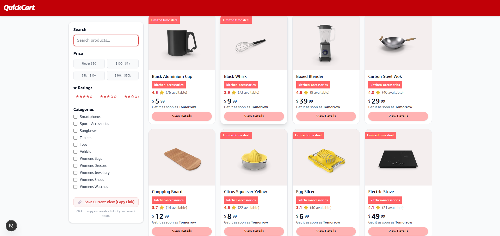

# Data-Heavy E-Commerce Frontend (Next.js)

A modern e-commerce front-end built with **Next.js 13**, featuring client-side search, filters, infinite scrolling, and dynamic product display.  
This project uses **React 18**, **TypeScript**, and **TailwindCSS** for styling. Notifications are implemented using **sonner**.

---

## 🎯 Core Functionality

### Product Listing
- Displays products in **grid** and **list** views.
- Implemented **pagination OR infinite scroll** for seamless browsing.
- Shows **skeleton loaders** during data fetch.

### Search
- **Debounced search input** (300–500ms) to prevent excessive API calls.
- **Cancelation of previous API requests/ IN-Flight Requests** using `AbortController` when typing.
- **X button** to clear the search input.
- Search term **syncs with URL** to preserve state across reloads.

### Filters
- **Categories:** Multi-select product categories.
- **Price Range:** Predefined price presets for easy selection.
- **Ratings:** Filter products by minimum star rating.
- **Sorting:** Sort products by price, rating, or alphabetical order.

### Selected Filters UI
- Active filters are displayed above the product list.
- Each filter has a `×` button for removal.
- **Clear All** button resets all filters.

### URL State Management
- All filters & search parameters are reflected in the URL.
- Page reload **preserves state**.
- Browser **back/forward navigation** works as expected.

### Notifications
- **Success Toasts:** Triggered when filters are applied or search is updated.
- **Error Toasts:** Triggered on API failures or when no products are found.
- Implemented using **sonner**. Include `<Toaster />` in your layout.

---

## ⚙️ Tech Stack

- **Next.js 13 (App Router)**  
- **React 18**
- **TypeScript**
- **TailwindCSS** for styling
- **sonner** for toast notifications
- **Fetch API / DummyJSON** for product data

---

## 🚀 Setup Instructions

### 1. Clone Repository
```bash
git clone <repo-url>
cd client
2. Install Dependencies - npm install
3. Run Development Server - npm run dev - Open http://localhost:3000 in the browser.
```

## Usage

### Searching
- Type keywords in the search bar.
- Input is debounced to avoid excessive API calls.
- Click the X button to clear the search.

### Applying & Saving Filter Preset and SEO metadata based on filters
- Select categories, price ranges, or ratings.
- Active filters appear above the product list.
- Remove a filter with its × button or Clear All to reset.
- Choose sorting from the dropdown: Featured, Price (Low → High / High → Low), Rating, or Name (A → Z).
- Toasts show updates when filters are applied or errors occur.
- Added SEO metadata based on filters.

### Infinite Scroll & Layout Toggle & Notifications
- Scroll down to automatically load more products.
- Switch between grid and list views using the toggle button.
- Toasts show updates when filters are applied or errors occur.
- Add <Toaster /> in your main layout to enable notifications.

## API Source
- Modify fetchProducts in utils/fetcher.ts to change backend or mock API.
- Categories & Prices: Update categoryMenu and pricePresets in utils/productUtils.ts.
- Styling: TailwindCSS classes can be customized for colors, spacing, or layout.

## Notes & Best Practices
- The app is initially SSR loaded and CSR-focused for fast user interactions.
- AbortController cancels pending requests when filters or search change.
- Debounced search improves performance and user experience.
- URL-driven state ensures shareable links with filters applied.
- SEO Metatags should be present
- Skeleton loaders maintain UI stability during data fetch.

## 📁 Project Structure

````
client/
├─ app/
│ ├─ page.tsx # Entry page
│ ├─ HomeClient.tsx # Main component handling products, filters, search, infinite scroll
├─ components/
│ ├─ ProductCard.tsx # Product card component
│ ├─ GridListView.tsx # Toggle between grid and list view
│ ├─ Skeleton.tsx # Loader skeleton for products
├─ types/
│ ├─ types.ts # TypeScript types
├─ utils/
│ ├─ fetcher.ts # API fetching logic
│ ├─ productUtils.ts # Filter, sort, category, price presets
````




### Performance Decisions

 - Debounced Search Input: By implementing a 500ms debounce on handleSearchInput, we prevent "API spamming." This ensures that network requests and heavy filtering logic only fire once the user has finished typing, significantly reducing CPU and network overhead.
 
 - Request Cancellation (AbortController): We use abortControllerRef to cancel "stale" fetch requests. If a user changes filters while a previous fetch is still in progress, the old request is killed immediately. This prevents race conditions where old data might arrive late and overwrite the newest results.
 
 - URL-Driven State: Using the URL as the "source of truth" for filters allows for native browser performance benefits (like the Back/Forward button) and ensures the page is SEO-friendly and shareable without adding complex global state libraries.
 
 - Intersection Observer API: For infinite scrolling, we chose the IntersectionObserver over traditional "scroll" event listeners. This is offloaded to the browser's main thread more efficiently.
 
 - Non-Blocking Navigation: Using navigation.push with { scroll: false } ensures that updating the URL doesn't trigger a full page jump, providing a "Single Page Application" (SPA) feel while maintaining a synchronized URL.
 

### Known Limitations

 - Client-Side Filtering Overload: The current logic runs filterAndSortProducts on the client after fetching. While fast for small batches, if the productNo (limit) is set too high, it may cause a minor UI lag on lower-end mobile devices during the render phase.
 
 - Single Category Constraint: The code currently includes a logic check: currentFilters.categories.length <= 1 ? currentFilters.categories : []. This implies the backend API may only support filtering by one category at a time; selecting multiple categories in the UI might result in an empty or unfiltered fetch.
 
 - Memory Growth: In a very long session of infinite scrolling, the itemList state will grow indefinitely. While not an issue for hundreds of items, thousands of items with complex DOM structures could eventually lead to increased memory usage in the browser tab.
 
 - Search/Filter Coupling: Because filters and search are bundled into a single currentFilters object, any minor filter change resets the pagination (offset to 0). This is intentional for accuracy but means a user loses their scroll position when they toggle a filter.
 
 - Initial Render Bypass: The firstRenderFlag avoids a double-fetch on load (since data is preloaded), but this means the very first view is not "fresh" if the preloadedProducts are cached or stale on the server side.
 
 ### Edge Cses Handled

 - API Race Conditions:  Cancled in-flight requests using AbortController to prevent mismatched results.
 
 - Search Debouncing: Added debounce to user input to avoid unnecessary API calls on every keystroke.
 
 - Invalid Price Ranges: Blocked API calls and showed a UI error when minPrice > maxPrice.
 
 - Next.js 15 Async Params: Handled URL parameters using await as per the latest Next.js standard.
 
 - Hydration Error Prevention: Used a mounted state to prevent server–client HTML mismatches.
 
 - Infinite Scroll Limits: Checked moreAvailable to stop background fetches when no more data exists.
 
 - Empty Search Results: Displayed a clean “No Results” UI with a “Clear All” option when filters return nothing.
 
 - SEO & Deep Linking: Synced dynamic metadata with URL state so filtered pages are shareable and indexable.
 
 - Memory Leaks: Properly disconnected IntersectionObserver and cleared setTimeout on unmount.
 
 - Zero-Price Range: Treated equal minPrice and maxPrice as a valid case and showed results or a proper empty state.
 
 
