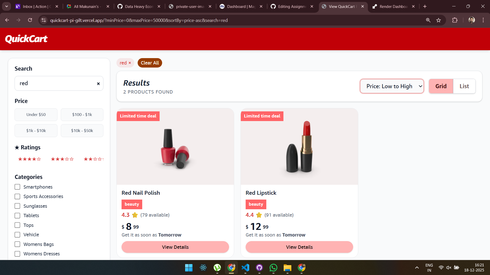
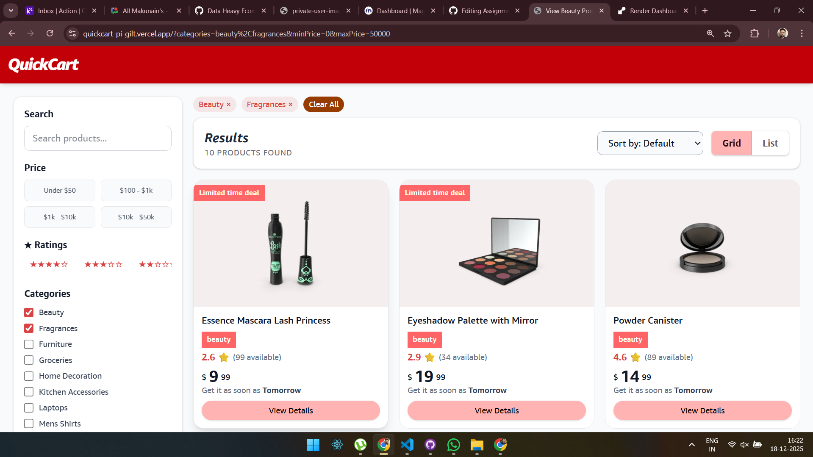
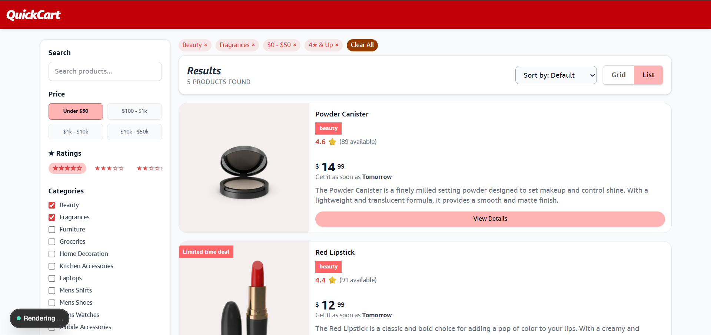
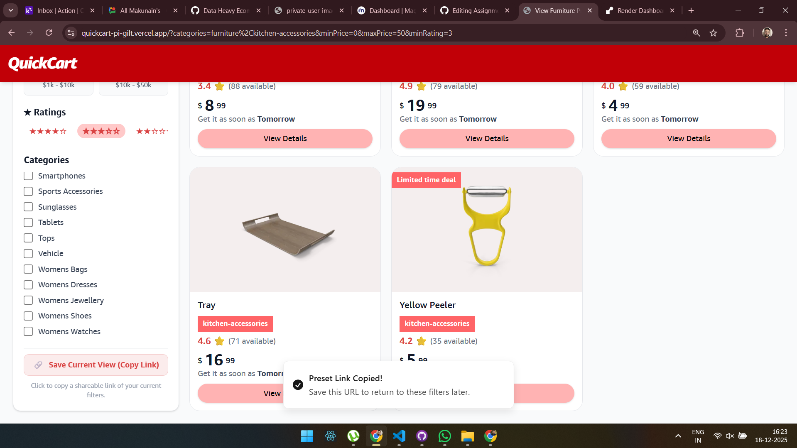
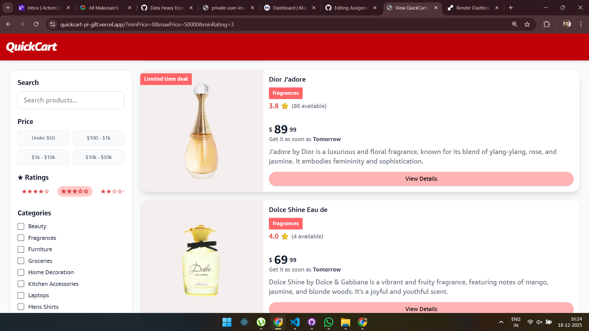

# Data-Heavy E-Commerce Frontend (Next.js)

A modern e-commerce front-end built with **Next.js 13**, featuring client-side search, filters, infinite scrolling, and dynamic product display.  
This project uses **React 18**, **TypeScript**, and **TailwindCSS** for styling. Notifications are implemented using **sonner**.

---

## 🎯 Core Functionality

### Product Listing
- Display products in **grid** and **list** views.
- Implement **pagination OR infinite scroll** for seamless browsing.
- Show **skeleton loaders** during data fetch.

### Search
- **Debounced search input** (300–500ms) to prevent excessive API calls.
- **Cancelation of previous API requests** using `AbortController` when typing.
- **X button** to clear the search input.
- Search term **syncs with URL** to preserve state across reloads.

### Filters
- **Categories:** Multi-select product categories.
- **Price Range:** Predefined price presets for easy selection.
- **Ratings:** Filter products by minimum star rating.
- **Sorting:** Sort products by price, rating, or alphabetical order.

### Selected Filters UI
- Active filters are displayed above the product list.
- Each filter has a `×` button for removal.
- **Clear All** button resets all filters.

### URL State Management
- All filters & search parameters are reflected in the URL.
- Page reload **preserves state**.
- Browser **back/forward navigation** works as expected.

### Notifications
- **Success Toasts:** Triggered when filters are applied or search is updated.
- **Error Toasts:** Triggered on API failures or when no products are found.
- Implemented using **sonner**. Include `<Toaster />` in your layout.

---

## ⚙️ Tech Stack

- **Next.js 13 (App Router)**  
- **React 18**
- **TypeScript**
- **TailwindCSS** for styling
- **sonner** for toast notifications
- **Fetch API / DummyJSON** for product data

---

## 🚀 Setup Instructions

### 1. Clone Repository
```bash
git clone <repo-url>
cd client
2. Install Dependencies - npm install
3. Run Development Server - npm run dev - Open http://localhost:3000 in your browser.
```

## Usage
### Searching
-- Type keywords in the search bar.
-- Input is debounced to avoid excessive API calls.
-- Click the X button to clear the search.

### Applying Filters
--Select categories, price ranges, or ratings.
-- Active filters appear above the product list.
-- Remove a filter with its × button or Clear All to reset.

### Sorting
-- Choose sorting from the dropdown: Featured, Price (Low → High / High → Low), Rating, or Name (A → Z).

### Infinite Scroll
-- Scroll down to automatically load more products.

### Layout Toggle
-- Switch between grid and list views using the toggle button.

### Notifications
-- Toasts show updates when filters are applied or errors occur.
-- Add <Toaster /> in your main layout to enable notifications.

## API Source
-- Modify fetchProducts in utils/fetcher.ts to change backend or mock API.
-- Categories & Prices: Update categoryMenu and pricePresets in utils/productUtils.ts.
-- Styling: TailwindCSS classes can be customized for colors, spacing, or layout.

## Notes & Best Practices
-- The app is CSR-focused for fast user interactions.
-- AbortController cancels pending requests when filters or search change.
-- Debounced search improves performance and user experience.
-- URL-driven state ensures shareable links with filters applied.
-- Skeleton loaders maintain UI stability during data fetch.

## 📁 Project Structure

````
client/
├─ app/
│ ├─ page.tsx # Entry page
│ ├─ HomeClient.tsx # Main component handling products, filters, search, infinite scroll
├─ components/
│ ├─ ProductCard.tsx # Product card component
│ ├─ GridListView.tsx # Toggle between grid and list view
│ ├─ Skeleton.tsx # Loader skeleton for products
├─ types/
│ ├─ types.ts # TypeScript types
├─ utils/
│ ├─ fetcher.ts # API fetching logic
│ ├─ productUtils.ts # Filter, sort, category, price presets
````






